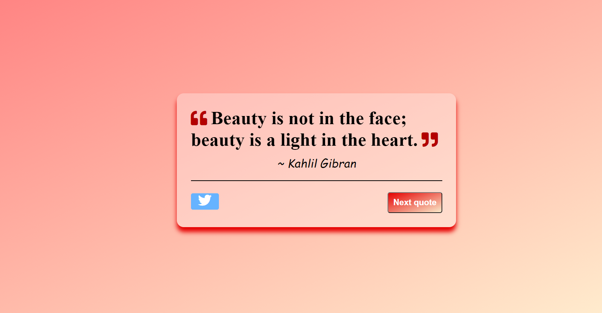

# Random Quote Generator
## Prerequisite
- Basic knowledge of HTML
- Basic knowledge of CSS
- Basic knowledge of JavaScript

## About the project
This application fetches a new random quote from an API, upon the click of a button, and displays it in the browser. You can find a step by step walkthrough in my Blog. Use the above linked image to navigate to my Blog.

## Some Snaps from the app

 ### Show some ❤️ by starring some of the repositories!
